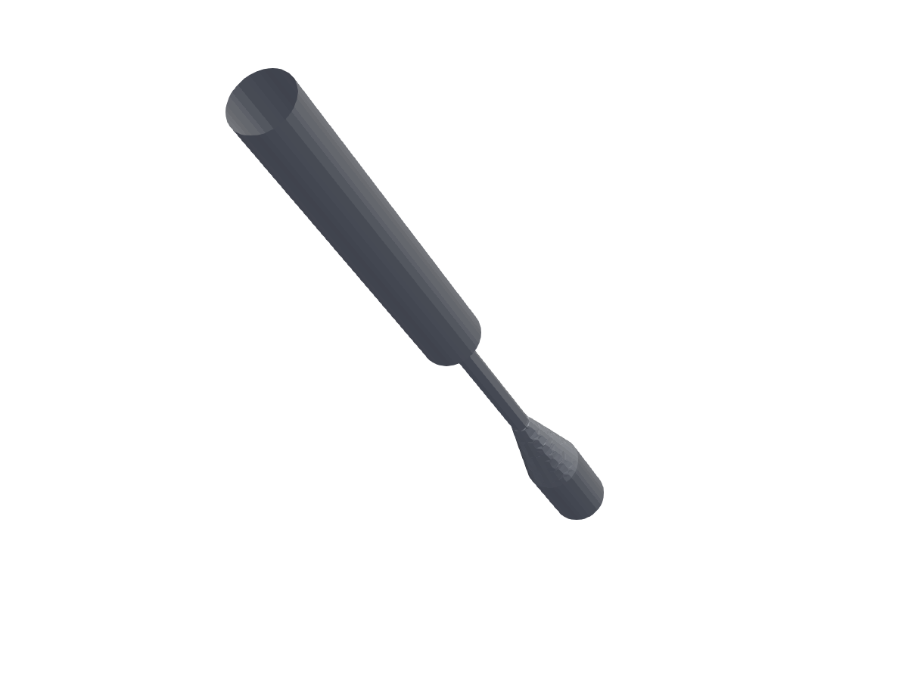
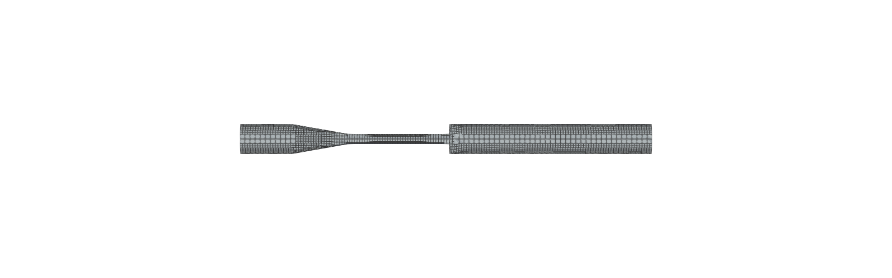
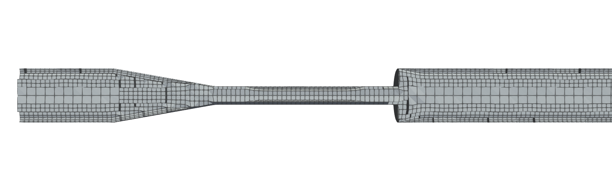
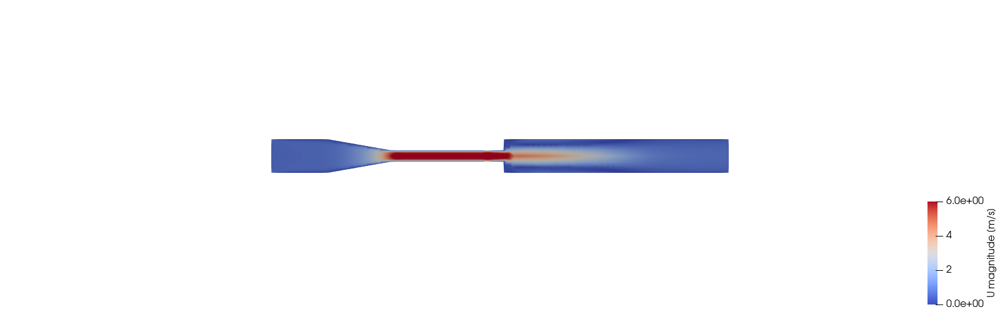
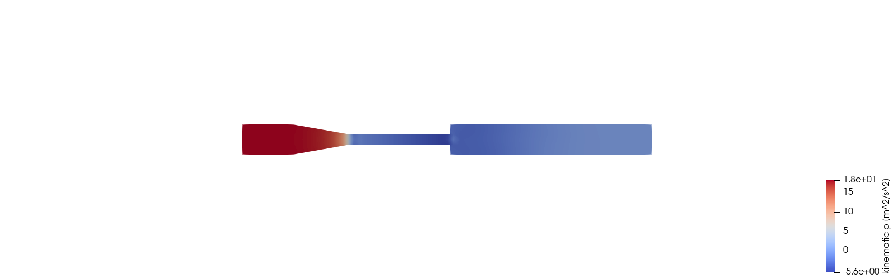
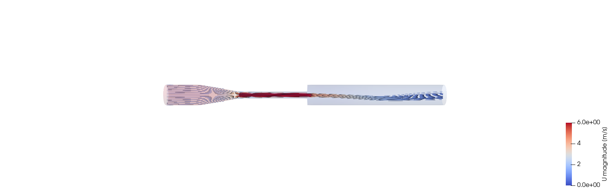
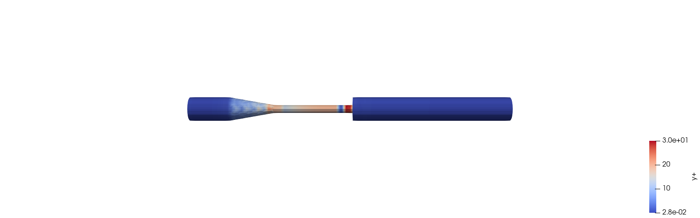

# FDA Nozzle CFD

Reproducible OpenFOAM CFD simulation of the FDA's public benchmark nozzle
geometry (the "FDA Nozzle" / "FDA Benchmark Medical Device" model), with the
goal of validating simulated flow fields against real experimental
velocimetry data (PIV / LDA velocity measurements) published for this
benchmark.



## Purpose

The FDA nozzle is a well-known round-robin CFD validation case for medical
devices, originally developed to assess whether CFD can reliably predict flow
in blood-contacting devices. This repository sets up an OpenFOAM case for
that geometry so that:

- Simulation results (velocity fields, pressure drop, shear stress) can be
  reproduced from scratch by anyone cloning this repo.
- Simulated velocity profiles at the benchmark's measurement planes can be
  compared directly against the publicly available experimental PIV/velocity
  data for the same geometry and flow conditions.

## Relation to the `hemolysis-calculator` project

This project is a companion/upstream data source for
[`hemolysis-calculator`](https://github.com/sarantisgkritsalis/hemolysis-calculator).
The velocity and shear stress fields produced by the CFD runs in this
repository are intended to be exported and fed into that project's
haemolysis (red blood cell damage) model as input flow data. In other words:

- **This repo (`fda-nozzle-cfd`)**: produces validated flow field data
  (velocity, shear stress) from CFD simulation of the FDA nozzle benchmark.
- **`hemolysis-calculator`**: consumes that flow field data to estimate
  haemolysis / blood damage using the shear stress history along
  streamlines.

Any changes to mesh resolution, turbulence model, or solver settings here
that affect the exported shear stress fields should be considered together
with their downstream impact on `hemolysis-calculator` results.

## Dependencies

- **OpenFOAM v2312** (or a compatible OpenFOAM.com release) — provides
  `blockMesh`, `snappyHexMesh`, `checkMesh`, `simpleFoam` used to build the
  mesh and run the case.
- **ParaView 6.x with `pvpython`** — only needed to regenerate the images in
  `plots/`, via `pvpython scripts/render_cfd_results.py` (solved fields;
  needs a completed `simpleFoam` run) and/or
  `pvpython scripts/render_mesh_geometry.py` (geometry/mesh only, works
  right after `blockMesh`/`snappyHexMesh`, no solve needed); not required to
  build the mesh or run the solver.
- **Python 3** (standard library only, no pip packages) — for
  `scripts/generate_nozzle_geometry.py`, which regenerates
  `constant/triSurface/fda_nozzle_wall.stl` from the published dimensions
  (see `constant/triSurface/SOURCES.md`).

There is no `requirements.txt` because nothing here is installed via pip:
`generate_nozzle_geometry.py` has no external dependencies, and
`render_cfd_results.py` runs inside ParaView's own bundled Python
(`pvpython`), not a separate virtualenv.

## Case structure

```
0/               Initial and boundary conditions (U, p, k, epsilon, etc.)
constant/        Mesh (polyMesh/), geometry (triSurface/), transport &
                 turbulence properties
system/          Solver control, discretization schemes, linear solver
                 settings, fvSchemes/fvSolution/controlDict
postprocessing/  Extracted results: velocity profiles at benchmark
                 measurement planes, pressure drop, wall shear stress
plots/           Generated plots comparing CFD results against experimental
                 PIV/velocity data
```

## Current Status & Future Work

Mesh, boundary conditions, and a first solver run are in place:

- **Mesh**: coarse `blockMesh` background (8100 cells) + `snappyHexMesh`
  (castellate, snap, and boundary layers on `nozzleWall`) around
  `constant/triSurface/fda_nozzle_wall.stl`. 43288 cells. `checkMesh`
  reports `Mesh OK` (max non-orthogonality 43.8°, max skewness 1.04, max
  aspect ratio 100.6 — high, but expected for the very thin near-wall
  cells a low-Re layer stack needs; not flagged as an error). Boundary
  layers: 12 target layers on `nozzleWall`, sized off the throat for a
  **low-Re target of y+ ~ 1** (`system/snappyHexMeshDict`; see "Why y+ ~ 1
  instead of y+ ~ 30" below for the reasoning); snappyHexMesh achieved
  82.3% face coverage, avg 8.51 of 12 layers, 77.7% of target thickness
  (the throat's 4 mm diameter caps how thick a layer stack fits there via
  `maxThicknessToMedialRatio`).



- **Fluid**: blood-analog Newtonian fluid from Hariharan et al. 2011
  (rho = 1056 kg/m^3, nu = 3.314394e-06 m^2/s), see
  `constant/transportProperties`.
- **Case run**: throat Re = 6500 (fully turbulent case), steady RANS with
  `simpleFoam` + kOmegaSST (`constant/turbulenceProperties`). Inlet/outlet
  velocities derived from Re via mass conservation
  (U_throat = 5.386 m/s, U_inlet = 0.598 m/s); see the comments in `0/U`,
  `0/k`, `0/omega` for the exact derivation. A transient `pimpleFoam`
  continuation (0.15 s) is also available, restarted from the steady
  state — see "Transient (`pimpleFoam`) run" below.

### Results (t=1000, throat Re=6500)

Rendered with `scripts/render_cfd_results.py` (pvpython); regenerate after
any new run with `pvpython scripts/render_cfd_results.py`.

**Velocity magnitude, axial slice** — acceleration through the throat,
diffusion after the sudden expansion:


**Pressure, axial slice** — pressure drop through the contraction, partial
recovery downstream:


**Streamlines** — seeded across the inlet diameter, colored by velocity
magnitude, shown over the wall outline:


**y+ on `nozzleWall`** — now consistently low (viscous-sublayer / low-Re
regime) across most of the wall, with a tail near the throat still above
the wall-function switch point (see below):


### Why y+ ~ 1 instead of y+ ~ 30

Two boundary-layer meshes were tried, in order:

1. **No boundary layers** (original mesh, 8100 cells): y+ on `nozzleWall`
   averaged ~11.5 (min 0.78, max 47.7).
2. **3 layers targeting y+ ~ 30 at the throat** (19944 cells): re-running
   `simpleFoam` on this mesh made y+ *worse*, not better — avg 4.51 (min
   0.16, max 24.5). Root cause: `snappyHexMesh`'s `firstLayerThickness` was
   one relative value, sized off the throat's shear (the highest on the
   wall). Away from the throat, in the lower-shear diffuser/expansion
   region, the same relative layer thickness produces a *smaller* y+
   (y+ is proportional to local friction velocity, which varies by more
   than an order of magnitude along the wall). A target window like y+ in
   [30, 300] is two-sided, so one relative sizing
   picked to hit it at the throat cannot also hit it everywhere else —
   it undershoots increasingly as shear drops. The throat's narrow 4 mm
   diameter compounded this: `maxThicknessToMedialRatio` capped the layer
   stack there too, so even the throat came in under the y+ = 30 target
   (max measured 24.5, only 3 layers at 88% of nominal thickness).
3. **12 layers targeting y+ ~ 1 at the throat** (current mesh, 43288
   cells): avg y+ dropped to 2.50, **median 0.20** — verified by
   independently summing the raw `nozzleWall` y+ field (4080 boundary
   faces) and matching `postProcess`'s reported min/max/average exactly.
   A low-Re target is one-sided (`y+ <~ 1-5` is "thin enough", with no
   upper-shear-dependent floor), so it gets *easier* to satisfy away from
   the throat instead of harder — the same shear variation that broke
   attempt 2 now works in its favour. A tail remains: ~15% of wall faces
   (640/4080) still exceed y+ = 5, 90th percentile 11.1, max 31.1 —
   concentrated at the throat, where the same medial-axis constraint from
   attempt 2 still limits how thin the layer stack can get.

This is corroborated by the wall function implementation itself, checked
directly against the OpenFOAM v2312 source
(`nutkWallFunctionFvPatchScalarField.C`): `nutkWallFunction` computes y+
per face and switches formula at `yPlusLam` (≈ 11, from the fixed point of
`log(E·y+)/kappa` with the default `kappa = 0.41`, `E = 9.8`) — using the
molecular-viscosity (laminar sublayer) value below that threshold and the
log-law value above it. Attempt 2's y+ values (0.16–24.5, straddling 11 on
both sides across the wall) meant many faces sat in the region where
*neither* assumption is a good approximation of the real (buffer-layer)
velocity profile. Attempt 3's median of 0.20 means the large majority of
`nozzleWall` now lands solidly on the laminar-sublayer branch, which is
the physically correct treatment once the mesh actually resolves that
layer — consistent with residual behaviour also improving markedly
(`bounding omega` events dropped from ~1000/1000 timesteps to 11/1000).
The throat tail (~15% of faces, still straddling the 11 switch point) is
the one part of the wall where this isn't fully resolved yet.

### Known limitations of this run (not yet resolved)

- **Residuals did not fully converge.** `U` residuals drop quickly early on
  then plateau (not down to the `residualControl` targets in
  `system/fvSolution`), with frequent "bounding k" events (830/1000
  timesteps on the current mesh). This is consistent with a known feature
  of the FDA nozzle benchmark at this Reynolds number reported in the
  literature: the shear layer downstream of the sudden expansion sheds
  vortices and is inherently unsteady, which a steady-state RANS solver
  cannot fully settle into a single fixed point. It is not necessarily a
  sign of a mesh or boundary-condition error.
- **y+ still has a throat-region tail above the wall-function switch
  point** (see above) — ~15% of `nozzleWall` faces exceed y+ = 5, up to
  31.1 at the throat, where the medial-axis constraint on the 4 mm throat
  limits how thin the layer stack can get.
- **Practical consequence**: wall shear stress from this run is much
  better supported than the earlier attempts, but the throat — the
  highest-shear region and the one most relevant to `hemolysis-calculator`
  — is exactly where the residual y+ tail sits. Treat shear stress
  elsewhere on the wall as trustworthy; treat the throat value with some
  caution until that tail is tightened further or the transient run (next
  steps) corroborates it.

### Transient (`pimpleFoam`) run

Restarted from the converged Step 2 steady state (`1000/`): `application`
switched to `pimpleFoam`, `ddtSchemes` to `Euler`, `PIMPLE` block added
with `nOuterCorrectors 1` (PISO-equivalent — one momentum-predictor +
2-corrector pressure loop per timestep). Ran 0.15 s of simulated time,
sized against the outlet-stub flow-through time
(`L_OUTLET_STUB / U_inlet = 0.080 / 0.598432 = 0.1337 s`).

**Fixed `deltaT = 1e-4 s`, not Co-adjusted.** `adjustTimeStep` was tried
first; the global max Courant number is dominated by the ~15 um
first-layer cells at the throat (Co in the thousands even at
deltaT ~1e-7 s), which would collapse the adaptive timestep to ~1e-10 s
and make the run infeasible. pimpleFoam's implicit Euler handling is
unconditionally stable there — that outlier cell just picks up extra
numerical diffusion locally, which is acceptable since the throat's
sublayer isn't the region Step 3 cares about resolving time-accurately —
so `deltaT` was instead picked by hand for Co ~ 1 on the downstream
shear-layer cell scale (~0.5 mm) at the post-expansion jet velocity
(~5.4 m/s). Confirmed stable in practice: max Co stayed ~0.8 for the
full 1500-step run, residuals bounded throughout, no NaN/divergence.
1500 timesteps, `ExecutionTime` 841 s (~14 min, serial, 1 core).

**Findings**: point probes in the shear layer downstream of the sudden
expansion (`shearLayerProbes` in `system/controlDict`, data under
`postProcessing/shearLayerProbes/`) show real time-dependent behaviour,
not a frozen steady field — e.g. the centerline probe 30 mm downstream of
the expansion rises from 3.26 m/s to a peak of 3.43 m/s at t=0.05 s, then
falls to 2.63 m/s by t=0.15 s (a ~23% swing). That's consistent with a
large-scale coherent structure (shear-layer roll-up / shed vortex)
convecting past the probe — exactly the behaviour a steady solver can't
represent.

**Not a clean pass**: 0.15 s only captures roughly half of what looks
like one oscillation cycle — not enough to measure a shedding frequency
or confirm periodicity. Resolving that would need a run several times
longer (multiple outlet-stub flow-throughs), which at the current
per-step cost (~0.56 s/timestep serial) is a multi-hour run. Treat this
result as confirmation that pimpleFoam produces genuine unsteady content
here (motivating the move away from steady RANS), not as a validated
shedding-frequency measurement.

### Next steps

1. **Extend the transient run**: continue `pimpleFoam` for several more
   outlet-stub flow-throughs to confirm periodicity and measure a
   shedding frequency/Strouhal number, rather than the single partial
   cycle captured so far.
2. **`hemolysis-calculator` hand-off**: once the transient run corroborates
   the shear stress field (including at the throat), add an export step
   that writes velocity + shear stress history along streamlines in the
   format `hemolysis-calculator` expects, and wire it into that project's
   haemolysis model as validated input.
3. **Post-processing script**: add the script (populating `postprocessing/`
   and `plots/`) that extracts velocity profiles at the benchmark's PIV
   measurement planes and plots them against the published experimental
   data, closing the loop described in "Purpose" above.
